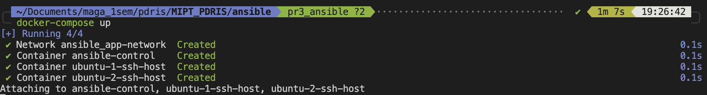
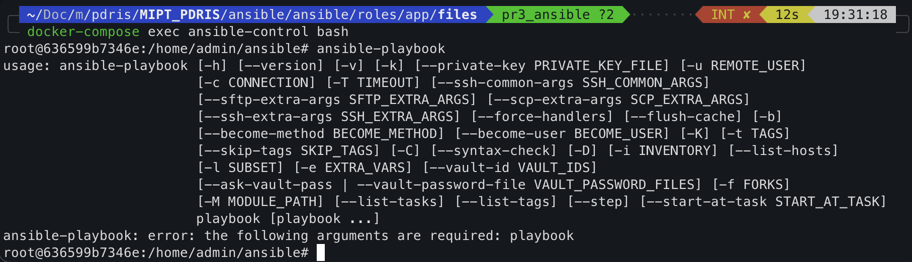
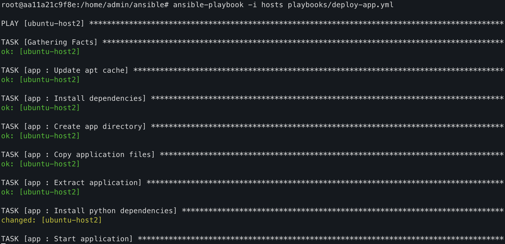
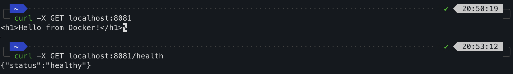
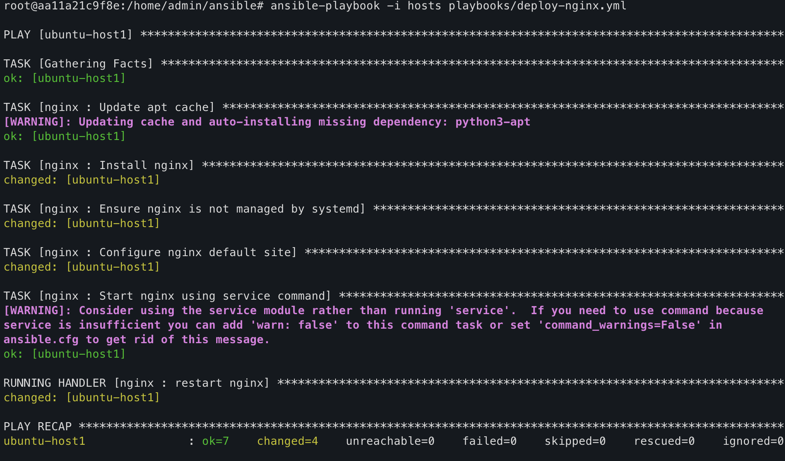
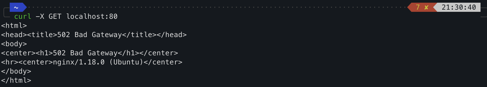

# Результаты выполнения ДЗ 3, Коршунов Пётр М05-511б

## Ansible
### Запуск трех контейнеров (один управляющий, два подчиненных)

### Проврека работы ansible

### Деплой приложения
#### Запуск playbook для деплоя приложения

#### Проверка работоспособности приложения

### Деплой NGINX
#### Запуск playbook для деплоя nginx

#### Проверка работоспособности NGINX
