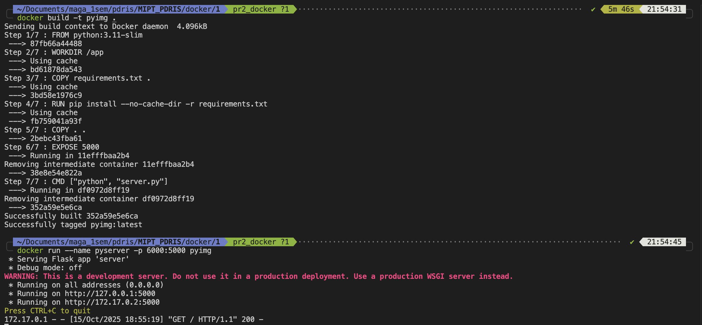
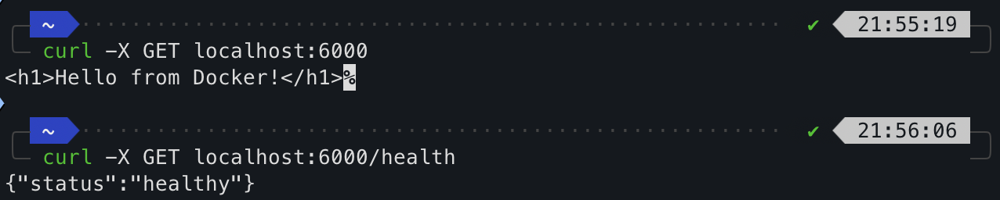
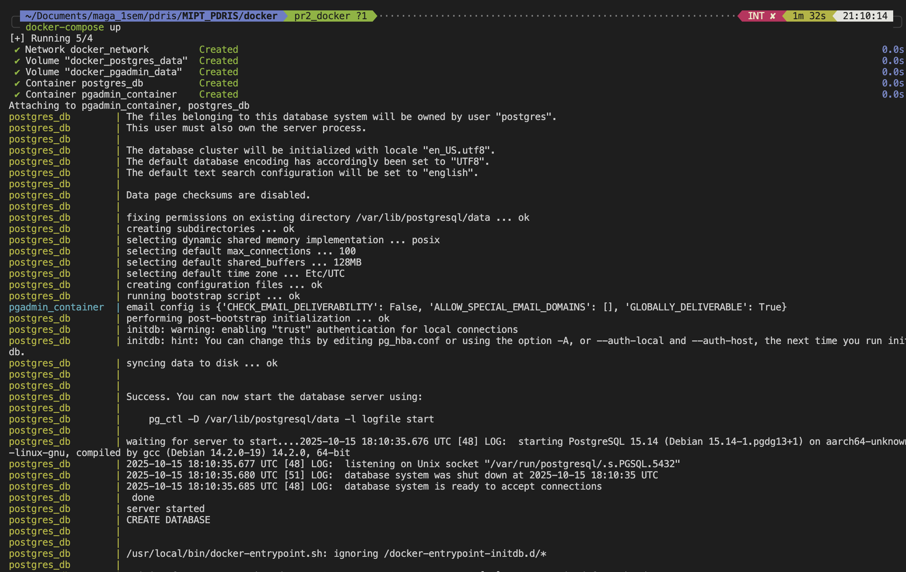
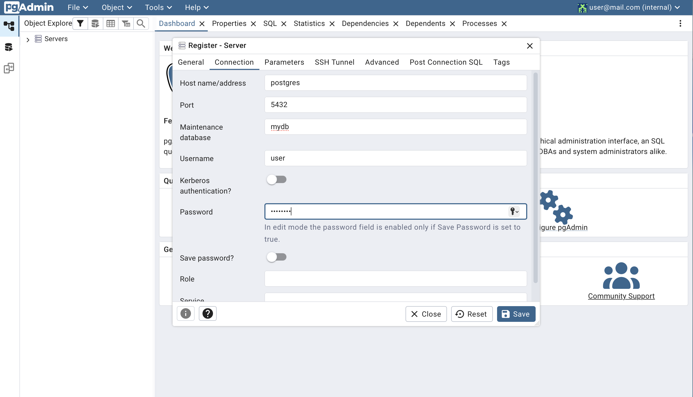
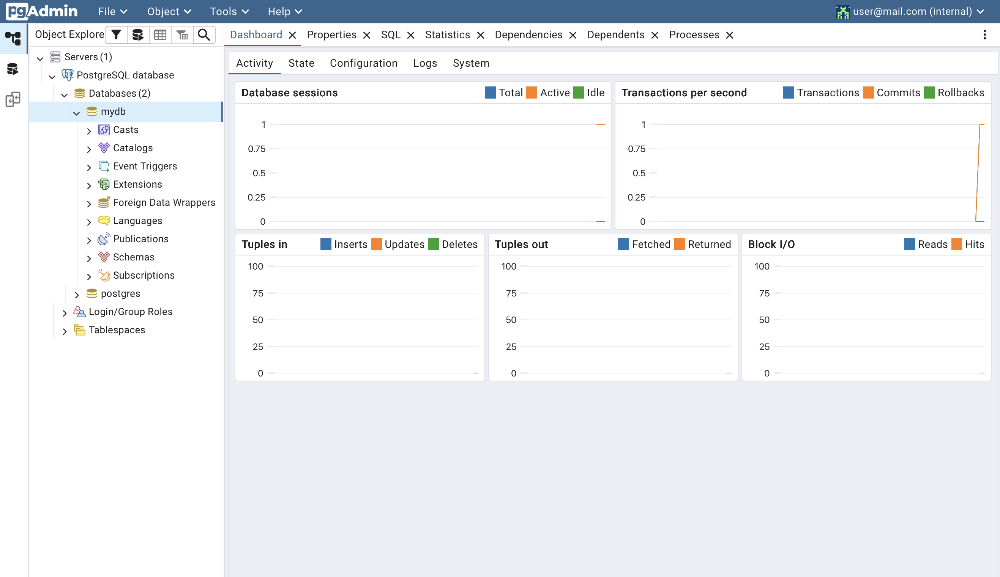
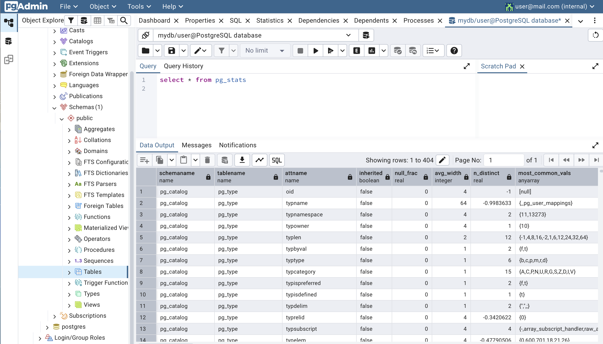

# Результаты выполнения ДЗ 2, Коршунов Пётр М05-511б

## Dockerfile
### Сборка образа и контейнера по образу, запуск контейнера

### Отправка запроса на веб-сервер в конейнере

## Docker-compose
### Запуск docker-compose

### Проверка сетевого доступа до БД по имени хоста postgres
#### Заполение данных для подключения

#### Результат подключения

#### Получение статистики БД

