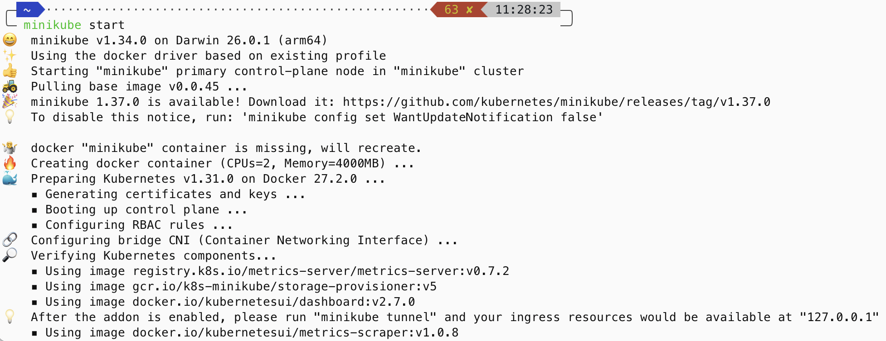
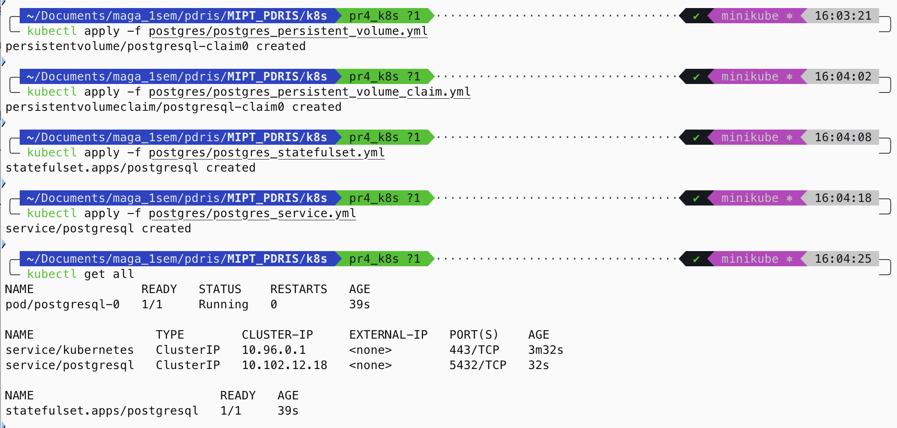
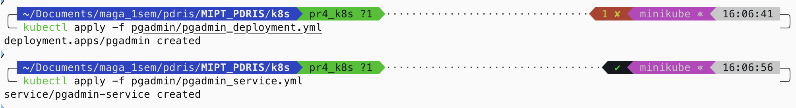
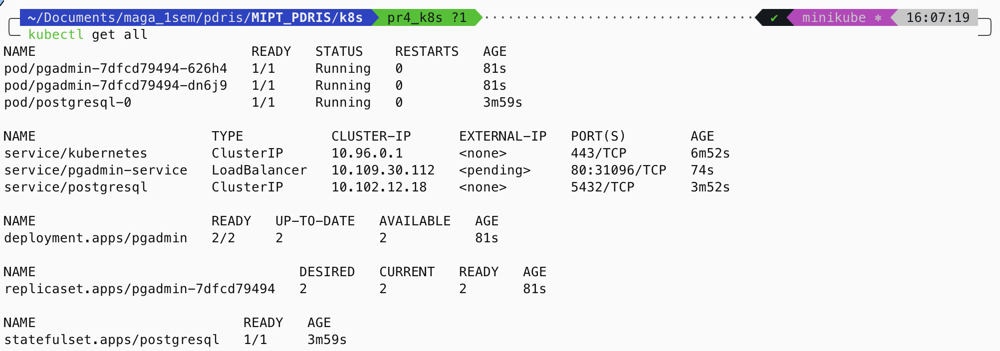
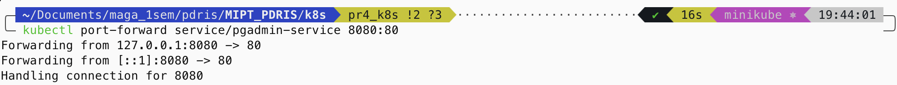
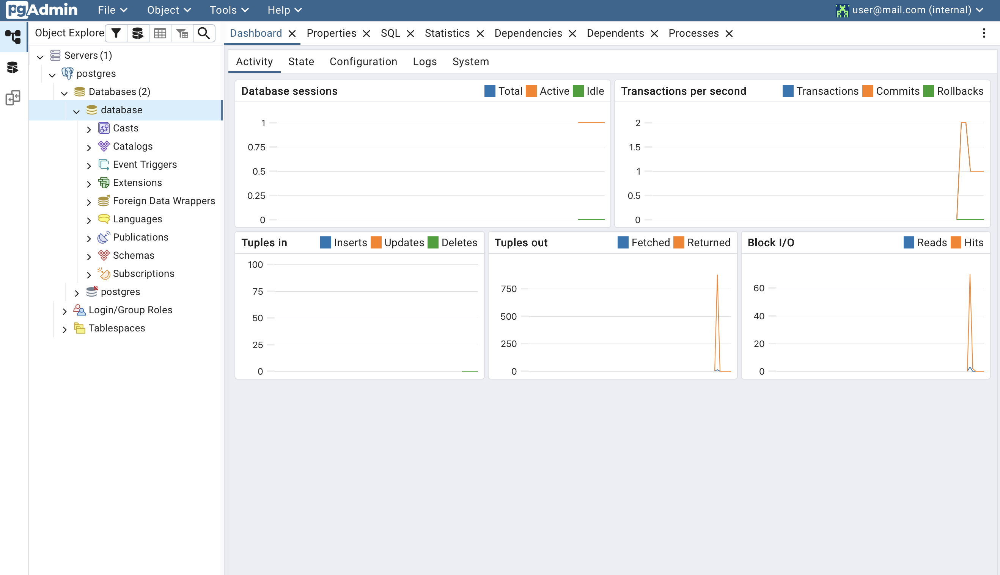

# Результаты выполнения ДЗ 4, Коршунов Пётр М05-511б

## Запуск minikube

## Деплой PostgreSQL (применение файлов для запроса volume, создания statefulset и service)

## Деплой Pgadmin (применение файлов для запроса volume, создания statefulset и service)

## Проверка состояния ресурсов

## Port-forward до сервиса извне кластера

## Проверка подключения к БД
